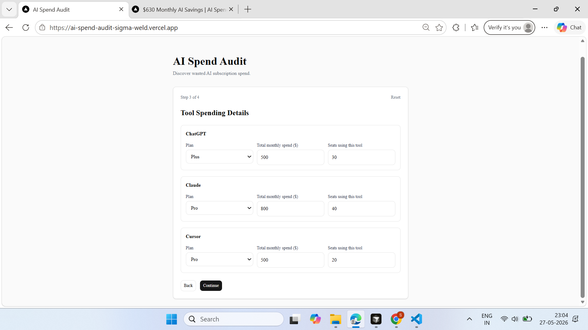
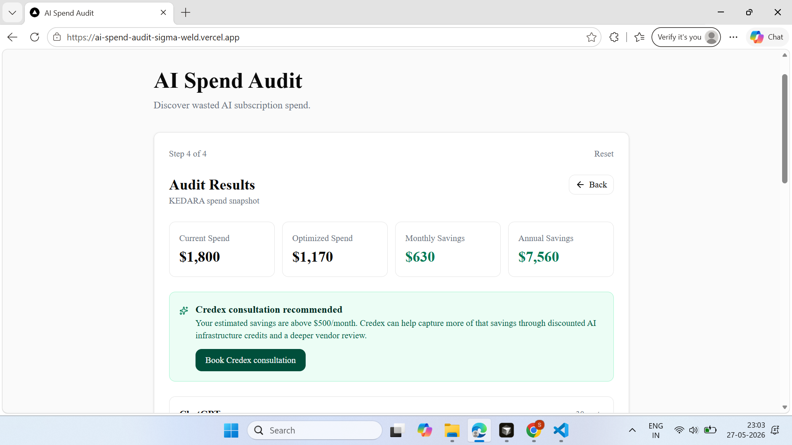
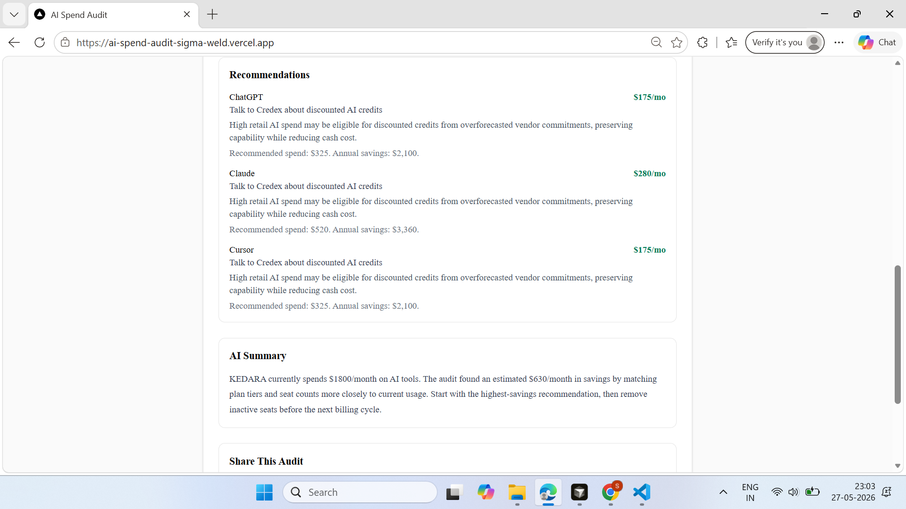
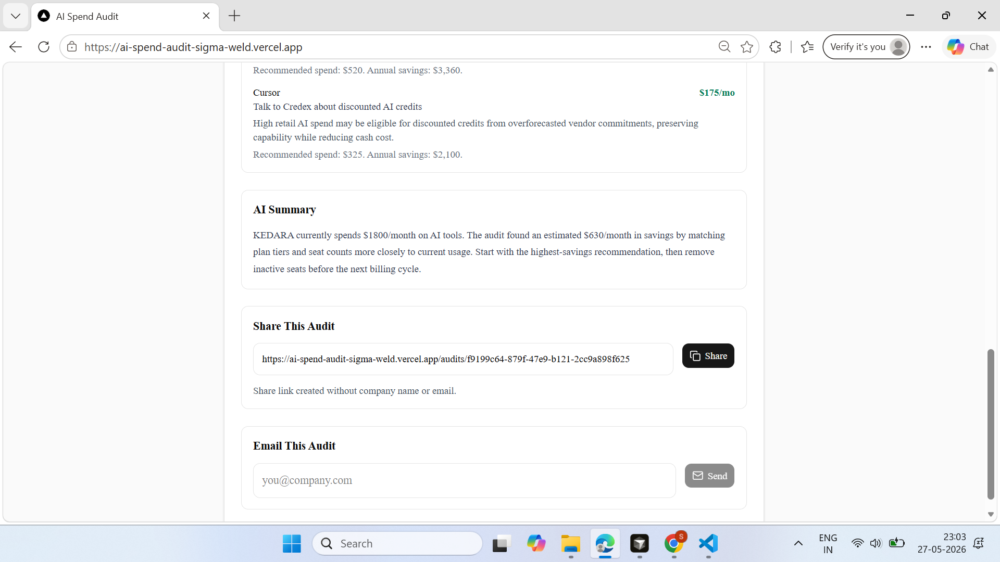
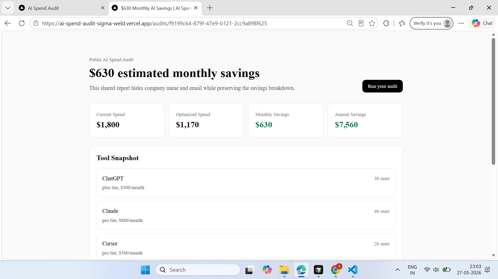

# AI Spend Audit

AI Spend Audit is a free web app for startup founders and engineering managers who want a fast second opinion on AI tooling spend. It collects a team's AI tools, plans, seat counts, use case, and monthly spend, then returns savings estimates, recommended actions, an AI-written summary, lead capture, and a privacy-safe share URL.

Live app: https://ai-spend-audit-sigma-weld.vercel.app

## Demo

### Tool spend details



### Main audit result



### Recommendations and AI summary



### Share link created



### Public shared report



## Quick Start

```bash
npm install
npm run dev
```

Open `http://localhost:3000`.

Required environment variables:

```env
NEXT_PUBLIC_SUPABASE_URL=
NEXT_PUBLIC_SUPABASE_ANON_KEY=
ANTHROPIC_API_KEY=
RESEND_API_KEY=
RESEND_FROM_EMAIL=
NEXT_PUBLIC_APP_URL=
```

Run checks:

```bash
npm run lint
npm test
npm run build
```

Deploy:

```bash
npx vercel --prod
```

## Decisions

- **Rule-based audit math instead of LLM math:** pricing and savings calculations need deterministic, testable reasoning. The LLM is used only for the summary paragraph.
- **Manual spend entry instead of billing integrations:** this keeps the MVP no-login and fast to try, at the cost of relying on user-entered data.
- **Email capture after results:** the app gives value before asking for email, matching the lead-gen requirement and improving trust.
- **Supabase with RLS:** quick real backend, public insert policies, and public read only for anonymized shared audit snapshots.
- **Privacy-safe sharing:** public URLs strip company name and email by storing a separate `public_audits` record with only tools and savings numbers.
